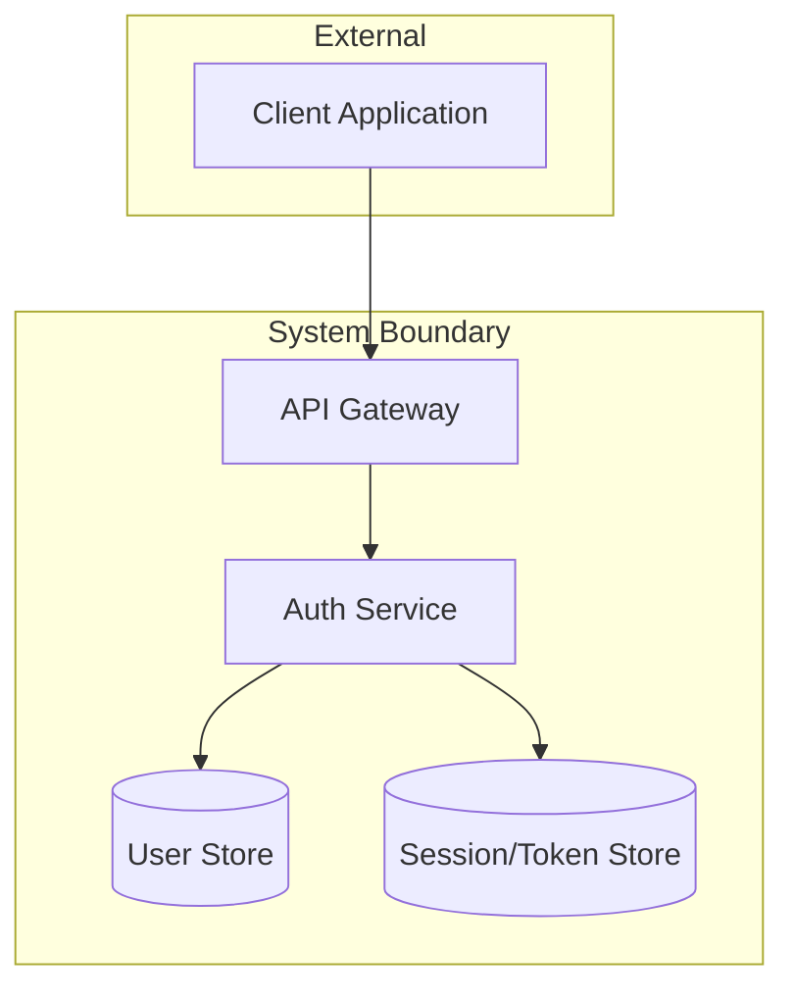
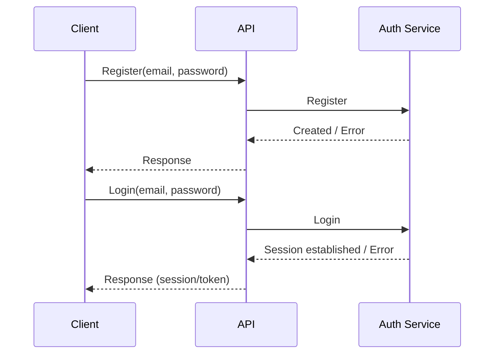
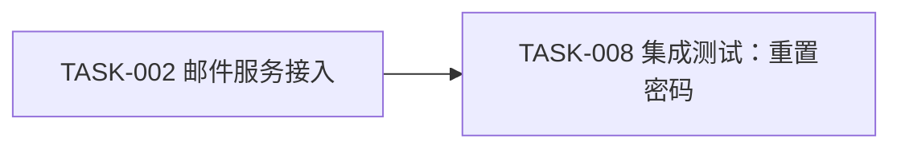

# 用户认证

> updated_by: Cascade - GPT-5
> updated_at: 2026-02-19 21:37:00

## Requirements

本示例用于展示：当用户给出 Requirements / Design / 约束后，`plan` skill 的目标产物应如何组织为**单文件**（仅包含 `Requirements` / `Design` / `Tasks` 三段；其中 `Design` 内包含 `Specs` 章节）。

- 本示例只演示“结构与口径”，不追求实现细节的完整性。
- `Design` 主文档强调**边界、契约、流程**；组件内部细节与数据模型细节应下沉到模块文档/代码注释。

当前系统缺少用户认证能力，所有功能均可匿名访问。随着引入用户私有数据（偏好设置、个人资料、订单/账单等），我们需要建立统一的身份识别与会话机制，以支持：

- 用户登录后访问“仅对本人可见”的数据与功能
- 服务端对敏感操作进行鉴权与审计
- 在不显著牺牲体验的情况下提升安全性与可恢复性

### Goals

- 用户可以使用邮箱 + 密码注册账号并登录
- 登录后能维持会话，并可访问需要登录的页面/接口
- 会话在浏览器重启后仍可恢复（在安全策略允许范围内）

### Non-Goals

- 社交登录（Google/GitHub 等）
- 双因素认证（2FA）
- 企业 SSO
- 账号体系之外的用户画像/资料编辑

### Scope

- 邮箱 + 密码注册
- 登录/登出
- 会话管理（访问令牌 + 刷新令牌或等价机制）
- 忘记密码/重置密码
- 受保护资源的鉴权中间件/网关策略

### Non-Scope

- RBAC / 权限系统（角色、权限点、后台管理）
- 管理员创建/禁用用户的完整运营后台

### Functional Requirements

<!-- // EARS（Easy Approach to Requirements Syntax）是一种用于编写清晰、可验证功能需求的句式模板；参考：`ears-format.md`。 -->

#### 常规（Ubiquitous）需求

- **FR-001**: 系统应支持邮箱 + 密码注册账号。
- **FR-002**: 系统应支持邮箱 + 密码登录。

#### 事件驱动（Event-Driven）需求

- **FR-010**: 当用户提交包含有效邮箱与密码的注册请求时，系统应创建新用户账号。
- **FR-011**: 当用户注册邮箱已存在时，系统应拒绝注册请求并返回明确的错误码。
- **FR-012**: 当用户提交有效凭证时，系统应建立已认证会话。
- **FR-013**: 当用户提交无效凭证时，系统应拒绝请求并返回 HTTP 401。

#### 状态驱动（State-Driven）需求

- **FR-020**: 在用户处于已认证状态期间，系统应为请求上下文附加可用于鉴权决策的用户身份信息。

#### 非期望行为（Unwanted Behavior）需求

- **FR-030**: 如果用户未认证，则系统不得允许其访问受保护资源。

### Success Metrics

| Metric                    | Current | Target  | How to Measure |
|--------------------------|---------|---------|----------------|
| 注册到首次登录成功率 | N/A | ≥ 95% | 客户端埋点 + 服务端日志对齐 |
| 受保护接口的未授权访问拦截正确率 | N/A | 100% | 集成测试 + 安全测试 |

### Dependencies

- **D-001**: 邮件服务能力（用于验证/重置密码）
- **D-002**: 统一的错误码规范（若项目已有标准，以标准为准）

### Constraints

- **C-001**: 不在服务端/客户端日志中记录明文密码、会话令牌等敏感信息
- **C-002**: 安全策略（例如 Cookie/Token 存储方式、过期时间）需满足现有合规与安全要求

### Assumptions

- **A-001**: 系统存在“受保护资源/页面”的清单或可被识别的路由前缀
- **A-002**: 业务允许通过登录态区分用户身份（非匿名强制）

### References

- **REF-001**: `ears-format.md`

## Design

### Architecture Overview

### Sequence Diagrams

#### UC-001 注册 + 登录（高层流程）

### API Design

#### API-001 Register

- **Endpoint**: `POST /api/v1/auth/register`
- **Description**: 创建用户账号

#### API-002 Login

- **Endpoint**: `POST /api/v1/auth/login`
- **Description**: 建立会话（签发访问令牌与刷新令牌，或返回等价会话凭证）

#### API-003 Logout

- **Endpoint**: `POST /api/v1/auth/logout`
- **Description**: 使当前会话失效（撤销刷新凭证/清理 Cookie 等）

### Specs（Design 内）

- **SPEC-001**: 鉴权边界应统一由 API Gateway 或统一中间件执行，并为下游服务提供一致的用户身份上下文。
- **SPEC-002**: 会话过期与刷新策略需明确：访问凭证短期有效；刷新凭证可撤销；登出可立即使刷新凭证失效。
- **SPEC-003**: 错误返回需可被客户端稳定识别（HTTP 状态码 + 结构化错误码）。

## Tasks

## 执行模式 (AI Agent 必读)

**仅支持阶段模式（Phase）：**

触发词：'执行第一阶段'、'execute setup'

行为：执行一个阶段（Phase）内的所有事项，然后等待用户确认再进入下一阶段

## Completion Checklist（AI Agent 义务，不是勾选模板）

- 确认所有 Story/Task 已按预期完成并在文档中标注完成状态
- 确认测试已通过（如有测试）
- 确认关键变更已完成 review（如适用）
- 确认必要的文档已更新（README/接口文档等）

## 概览

| Phase           | Tasks | Completed | Progress |
|-----------------|-------|-----------|----------|
| Setup           | 3     | 0         | 0%       |
| Implementation  | 4     | 0         | 0%       |
| Testing         | 3     | 0         | 0%       |
| Documentation   | 2     | 0         | 0%       |
| **Total**       | **12**| **0**     | **0%**   |

## Dependencies & Blockers

## Changelog

{我们以“最新的设计/决策”为准，不需要维护面向历史版本的变更记录；大多数更新应直接体现在 Design（含其下的 Specs）中。此处仅用于记录少量适合放在 Tasks 侧的 memory，例如关键场景、容易误解的边界、踩坑与注意事项，用于帮助后续执行与对齐。}

{date}: {memory}

{date}: {memory}

## Task Breakdown

### Phase 1: Setup

- [ ] **TASK-001**: 明确受保护资源的清单与鉴权边界（网关/中间件策略）
  - **Complexity**: Low
  - **Files**: N/A
  - **Dependencies**: None
  - **Notes**: 输出：受保护路由/资源规则；以及“身份上下文”字段定义（userId/tenantId 等）。

- [ ] **TASK-002**: 邮件服务对接（用于重置密码）
  - **Complexity**: Medium
  - **Files**:
    - `docs/auth/email.md`
  - **Dependencies**: TASK-001
  - **Notes**: 明确：发送频率限制、模板、失败重试策略。

- [ ] **TASK-003**: 统一错误码与客户端可识别的错误结构
  - **Complexity**: Low
  - **Files**:
    - `docs/auth/errors.md`
  - **Dependencies**: TASK-001
  - **Notes**: 至少覆盖：邮箱已存在、密码不合法、凭证错误、未授权、会话过期。

### Phase 2: Implementation

- [ ] **STORY-001**: 注册/登录/登出主流程打通
  - **Complexity**: High
  - **Files**:
    - `src/auth/*`
  - **Dependencies**: TASK-002, TASK-003
  - **Notes**:

  - [ ] **TASK-004**: 注册接口实现（含输入校验、重复邮箱处理）
    - **Complexity**: Medium
    - **Files**: `src/auth/register.*`
    - **Dependencies**: TASK-003
    - **Notes**: 验收：重复邮箱返回稳定错误码；成功后可登录。

  - [ ] **TASK-005**: 登录接口实现（建立会话/签发凭证）
    - **Complexity**: Medium
    - **Files**: `src/auth/login.*`
    - **Dependencies**: TASK-003
    - **Notes**: 验收：错误凭证 401；成功后可访问受保护资源。

  - [ ] **TASK-006**: 登出接口实现（撤销刷新凭证/清理 Cookie）
    - **Complexity**: Medium
    - **Files**: `src/auth/logout.*`
    - **Dependencies**: TASK-005
    - **Notes**: 验收：登出后刷新凭证失效；再访问受保护资源应失败。

- [ ] **TASK-007**: 受保护资源鉴权中间件/网关策略落地
  - **Complexity**: Medium
  - **Files**: `src/middleware/auth.*`
  - **Dependencies**: STORY-001
  - **Notes**: 验收：未登录访问返回 401；登录后可访问。

### Phase 3: Testing

- [ ] **TASK-008**: 集成测试：注册→登录→访问受保护资源→登出→再次访问
  - **Complexity**: Medium
  - **Files**: `tests/integration/auth-flow.*`
  - **Dependencies**: TASK-007
  - **Notes**: 以端到端路径验证核心目标。

- [ ] **TASK-009**: 安全测试：暴力破解/频率限制/敏感字段不落日志
  - **Complexity**: Medium
  - **Files**: `tests/security/auth-security.*`
  - **Dependencies**: STORY-001
  - **Notes**: 输出：关键风险点的可复现实验与结论。

- [ ] **TASK-010**: 会话过期与刷新策略测试
  - **Complexity**: Medium
  - **Files**: `tests/integration/auth-refresh.*`
  - **Dependencies**: STORY-001
  - **Notes**: 覆盖：访问凭证过期、刷新凭证撤销、登出后刷新失败。

### Phase 4: Documentation

- [ ] **TASK-011**: 更新接口文档（仅描述本需求强相关的边界与对接点）
  - **Complexity**: Low
  - **Files**: `docs/api/auth.md`
  - **Dependencies**: STORY-001
  - **Notes**: 避免在主 Design 重复通用规范；通用规范应由独立工作流维护。

- [ ] **TASK-012**: 更新运行手册/排障指南（常见错误码、排查路径）
  - **Complexity**: Low
  - **Files**: `docs/runbook/auth.md`
  - **Dependencies**: TASK-011
  - **Notes**: 便于线上问题快速定位。
