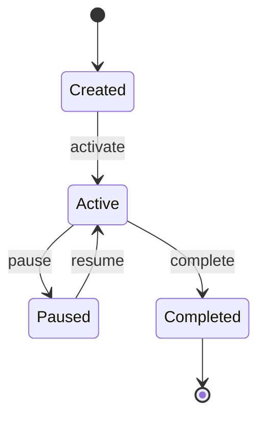
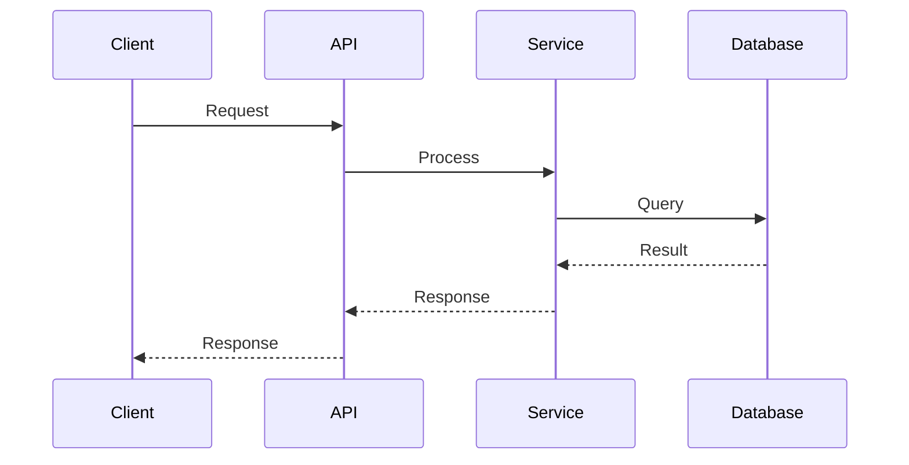

# Design

{本节用于描述系统级的设计与对接约定，目标是让不同模块/团队在同一套抽象与接口边界下协作。}

## 设计文档的定位（宏观 / 协调优先）

{本文档用于描述系统级的设计与对接约定，目标是让不同模块/团队在同一套抽象与接口边界下协作（what/why/how 的“宏观 how”）。}

{业界常见做法是：}

- {组件内部细节（类/函数级接口、docstring、局部实现策略）应下沉到组件自身的文档与代码注释中，而不是堆在 Design 的主文档里。}
- {数据模型细节（表结构/字段/索引/ER 图等）也应由对应的领域/组件负责在自身文档中维护，避免主文档承担过多局部细节。}
- {Design 主文档更应关注：边界、契约、数据与流程、错误与兼容策略、跨模块依赖与对齐点。}

{备注：如果确实需要组件级设计，通常更适合在 Tasks 阶段按具体任务拆解补充（并指向对应代码/模块）。}

## Architecture Overview

{High-level system architecture}

```mermaid
graph TD
    subgraph "External"
        Client[Client Application]
    end

    subgraph "System Boundary"
        API[API Gateway]
        Service[{Feature} Service]
        DB[(Database)]
    end

    Client --> API
    API --> Service
    Service --> DB
```

## State Machine

{If applicable, show state transitions}



## Sequence Diagrams

### UC-xxx {Use Case Name}



## API Design

### API-001 {Endpoint Name}

**Endpoint**: `{METHOD} /api/v1/{resource}`

**Description**: {what this endpoint does}

{通用标准（例如 API 的请求/响应格式与状态码约定、Error Handling、Security Considerations、Performance Considerations 等）不在 Design 中重复展开，原因是这些内容更适合由独立工作流统一维护，以避免口径漂移与跨文档不一致；在此仅关注与本需求强相关的接口边界与对接点。}

{Component Design 与 Data Model 属于领域/组件内部设计，不在主 Design 中维护；这些细节应下沉到对应模块的文档与代码注释中，以保持主文档的宏观抽象用于协调整体对接。若需要对齐，建议在 Tasks 阶段按任务补充并链接到对应模块。}

## Specs

- [ ] **SPEC-001**：{Spec 名称}
  - **背景 / 目标**：{用 1-2 句话说明为什么需要这个 Spec，以及它要解决什么问题}
  - **范围**：{覆盖哪些模块/流程；不覆盖哪些}
  - **关键决策**：{做了什么选择；为何这么选；不确定点写明}
  - **实现约束**：
    - {约束 1}
    - {约束 2}
  - **接口 / 对接点**：{需要对齐的输入/输出/事件/状态/配置项}
  - **命令 / 操作**：{可执行命令或操作步骤；如无可留空}
  - **验收（勾选即证据）**：
    - [ ] {验收点 1}
    - [ ] {验收点 2}
