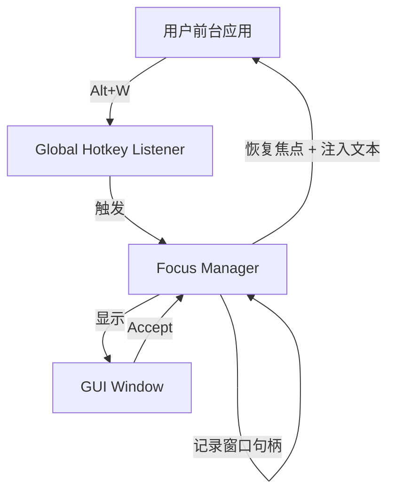
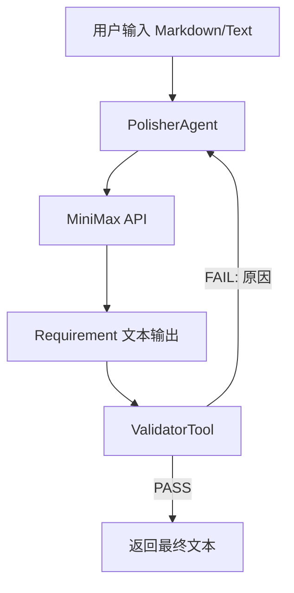
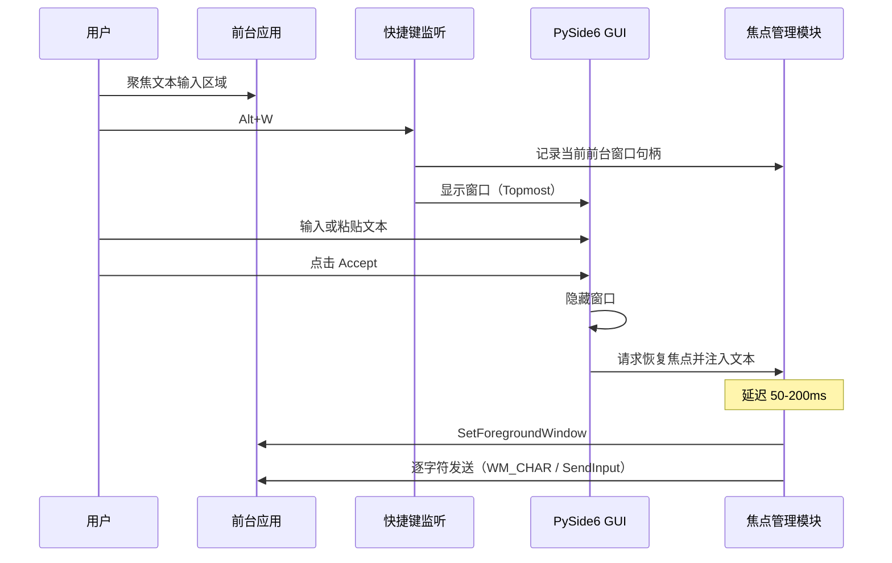
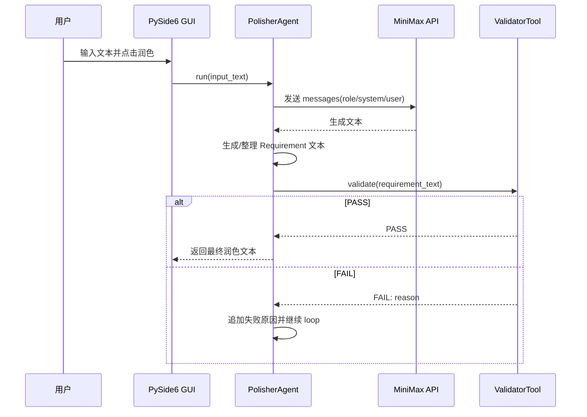
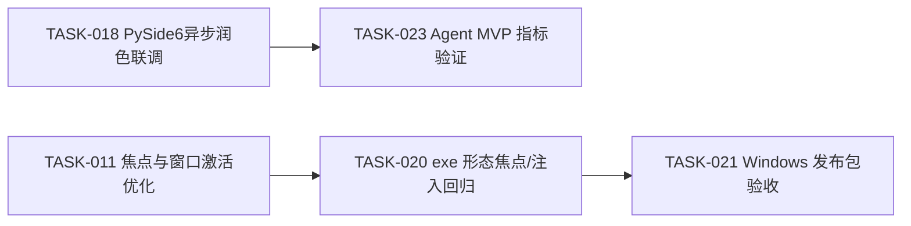

# Windows 桌面级文本回填验证工具（MVP3）

> updated_by: VSCode - Claude-Opus-4.6
> updated_at: 2026-02-20 11:51:00

## Requirements

本项目聚焦于 Windows 桌面文本回填场景，目标是在不依赖输入法、不引入复杂桌面框架的前提下，以可执行文件（`.exe`）形态稳定实现「显式唤起 → 文本编辑 → 回填原焦点窗口」的低摩擦交互闭环，并作为后续产品化能力的基础；同时明确以 `.exe` 作为最终验证载体，以避免开发环境假象。

在该桌面闭环能力之上，项目当前实现了 Text-only Agent 能力：用户可在 GUI 中发起文本润色，系统执行"生成 → 验证 → 失败反馈重试"的质量闭环，并将结果异步回写到界面输出区；在模型能力不可用时，应用仍保持桌面回填主流程可运行，Agent 功能按降级策略处理。

### Goals

- 在 Windows 上运行一个独立桌面程序
- 通过全局快捷键显式唤起 GUI
- GUI 采用 PySide6，提供左右两个文本编辑区域
- 用户点击 Accept 后，将右侧文本回填到唤起前获得焦点的窗口
- 验证关键能力可行性：
  - 全局快捷键
  - 焦点保存与恢复
  - 文本注入（含长文本、换行）
- 在现有 Python 项目中提供干净的 Text-only Agent Protocol
- 实现 Markdown 文本 I/O：用户输入 → MiniMax 处理 → 返回 Requirement 文本（可包含 `<Requirement>` 标签）
- 保证 Agent 请求级无状态（stateless）：请求间互不影响
- 通过 loop 做输出质量验收（而非 schema 校验）
- 在 Windows 平台实现原生风格适配（Fluent Design 方向）

### Non-Goals

- 不验证润色算法本身（可手动输入或原样复制）
- 不追求跨平台视觉一致性（以 Windows 风格为准）
- 不考虑异常路径、失败处理
- 不考虑跨平台（仅 Windows）
- 不实现多模型并行（MVP 阶段）
- 不实现强 schema 校验
- 不实现 IDE / filesystem / OS side-effect 操作
- 不实现长期记忆 / RAG 与复杂 planner / critic 架构

### Scope

- Windows 下可运行的单体桌面程序（Python）
- 全局快捷键唤起窗口
- 双文本区编辑与 Accept 写回
- 对典型应用场景完成可重复的手工验收
- 可选的关键操作日志（不影响核心验证）
- 以可执行文件（`.exe`）作为最终验证载体
- PySide6 双区布局（上文字区 + 下按钮区）与关键对齐规则
- 系统托盘常驻能力（最小化到托盘）
- 提供 Agent 协议能力：role / system prompt / loop / 输出提取
- 接入 MiniMax（MVP）并支持 Requirement 文本输出
- 提供可选 text → text 工具链（纯函数、无副作用）

### Non-Scope

- 复杂异常/失败处理与重试策略
- 取消/中断流程、窗口丢失等边界场景
- 跨平台（macOS/Linux）兼容性
- 任何需要管理员权限的方案
- 超出既有需求的功能扩展推测
- 现实世界工具自动调用（如 write_file / grep / shell）
- 过度强制化输出结构

### 功能需求（Functional Requirements）

参考：`ears-format.md`

#### 事件驱动（Event-Driven）需求

- **FR-001**: 当用户按下全局快捷键时，系统应将工具窗口显示为置顶（topmost）。
- **FR-002**: 当工具窗口显示时，系统应记录激活前拥有焦点的前台窗口句柄（HWND）。
- **FR-003**: 当用户点击 Accept 时，系统应先隐藏/关闭工具窗口，再尝试恢复焦点。
- **FR-004**: 当用户点击 Accept 时，系统应恢复到先前记录的窗口句柄（HWND）。
- **FR-005**: 当先前记录窗口重新获得焦点时，系统应将输出文本注入该窗口。
- **FR-006**: 当用户触发文本润色时，系统应将 Markdown/文本输入发送到基于 MiniMax 的 Agent 协议，并返回面向 Requirement 的输出文本。
- **FR-007**: 当基于 loop 的质量验证失败时，系统应在最大步数内继续迭代，并将失败原因反馈回模型上下文。

#### 常规（Ubiquitous）需求

- **FR-010**: 系统应支持长文本与多行文本注入。
- **FR-011**: 系统应支持中文字符注入。
- **FR-012**: 系统在端到端流程中不应要求管理员权限。
- **FR-013**: 系统应以无状态（stateless）方式处理 Agent 请求，并将 loop 运行态严格隔离在当前请求内。
- **FR-014**: 系统应保持可选工具为纯文本输入输出（text → text）且无副作用。

#### 非期望行为（Unwanted Behavior）需求

- **FR-020**: 如果工具窗口仍在前台，则系统不得尝试向先前记录窗口注入文本。

### Success Metrics

| Metric | Current | Target | How to Measure |
|--------|---------|--------|----------------|
| 端到端闭环可用性 | N/A | 通过 DoD | 按验收场景手工验证并记录证据 |
| Agent 协议可用性 | N/A | 通过 DoD | 输入文本后稳定返回 Requirement 文本，并验证 loop 上限与 stateless 行为 |

### Dependencies

- **D-001**: Windows 全局快捷键能力（`keyboard` 或等价方案）
- **D-002**: Windows 焦点管理与文本注入能力（Win32 API：`pywin32` 或 `ctypes`）
- **D-003**: 打包为 `.exe` 的能力（PyInstaller）
- **D-004**: MiniMax API 可用性（鉴权与网络连通）
- **D-005**: smolagents 框架能力
- **D-006**: PySide6 框架能力（Qt Widgets / Layout / SystemTray）

### Constraints

- **C-001**: 平台仅 Windows
- **C-002**: 最终交付物必须为 Windows 单一可执行文件（`.exe`），且可在未安装 Python 的机器上运行
- **C-003**: 需支持中文、多行、长文本注入
- **C-004**: 不记录用户文本内容到日志
- **C-005**: 焦点恢复顺序必须为：隐藏 GUI → 恢复焦点 → 适当延迟 → 文本注入
- **C-006**: Agent 仅处理文本输入输出，工具必须无副作用
- **C-007**: loop 用于质量验收，不用于 schema 强校验
- **C-008**: GUI 相关决策以 PySide6 最终实现为准；如与早期 Tkinter 方案冲突，以 PySide6 方案为准
- **C-009**: 平台限制为 Windows；GUI 以现有 PySide6 实现为唯一基线
- **C-010**: GUI 实施以给定输入为准，不做超范围功能扩展推测
- **C-011**: 布局优化不得破坏既有核心能力与当前对齐规则

### Assumptions

- **A-001**: 用户在触发快捷键前，已在目标应用的文本输入区域产生焦点
- **A-002**: 正向场景验证即可（一次性、单向完成），不覆盖取消/异常路径
- **A-003**: Agent 的能力来自 LLM，本体仅作为协议壳（Agent as Protocol）

### References

## Design

### 设计文档的定位（宏观 / 协调优先）

本文档的 Design 部分用于固定"可复现的交互闭环"和"跨模块对齐点"（快捷键、焦点恢复、文本注入、Agent 协议、打包与验收），组件内部实现细节（类/函数级）应下沉到代码。

### 技术选型（固定）

| 能力 | 技术 |
|------|------|
| 语言 | Python 3.x |
| GUI | PySide6（最终） |
| 全局快捷键 | `keyboard` |
| 焦点 / 文本注入 | Win32 API（`pywin32` 或 `ctypes`） |
| Agent 框架 | `smolagents` |
| Agent 模型（MVP） | MiniMax |

### 核心交互模型

1. 用户在任意应用的文本输入区域中产生焦点
2. 用户通过全局快捷键唤起本工具
3. 工具窗口显示在桌面最前（Topmost）
4. 用户在工具窗口左侧输入或粘贴文本
5. 用户点击按钮，将文本复制到右侧（或直接使用右侧内容）
6. 用户点击 **Accept**
7. 工具将右侧文本回填到原焦点窗口

> MVP3 假设该流程 **一次性、单向完成**。

在文本润色路径中，系统额外执行：用户文本输入 → Agent 协议组装（role / system prompt / loop）→ MiniMax 调用 → 生成 Requirement 文本（可包含 `<Requirement>`）→ 回写右侧文本区。

### 组件划分

| 组件 | 职责 |
|------|------|
| Global Hotkey Listener | 监听 Alt+W，触发 GUI 唤起 |
| Focus Manager | 记录唤起前的前台窗口句柄、恢复焦点、注入文本到目标窗口 |
| GUI Window (PySide6) | 显示文本区域与按钮 |
| PolisherAgent | 处理润色主流程（Text-only） |
| ValidatorAgent / ValidatorTool | 执行质量校验并给出 PASS/FAIL |
| Logger Module | 记录关键操作日志（可选，不影响核心功能） |

### Architecture Overview



### Agent 协议架构（Text-only）



### Sequence Diagrams

#### 正向场景：唤起 → 输入 → Accept → 回填



#### 正向场景：Agent 润色 → 验收循环 → 输出



### Agent 核心约束

| 约束 | 描述 |
|------|------|
| 输入 | Markdown / 自然语言文本 |
| 输出 | Requirement-oriented Markdown 文本（可包含 `<Requirement>` 标签） |
| LLM | 调用 MiniMax API，携带 system prompt 和参数 |
| Loop | 最大步数限制（如 3），用于质量验收，不做 schema 校验 |
| Stateless | 每次请求独立；loop 内状态在请求结束后释放 |
| Tools | 可选，仅 text → text，纯函数，无副作用 |
| 内置验证工具 | ValidatorTool 使用独立 model 与 prompt 执行验证，返回 PASS/FAIL；验证结果追加到 messages context，失败原因回传主模型用于改进 |
| Agent 职责 | 管理 role/prompt/loop/输出提取，不承担能力本身 |
| Agent 架构 | `_TextAgent`（协议基类）→ `PolisherAgent`（润色）/`ValidatorAgent`（单次验证）；`ValidatorTool` 封装 `ValidatorAgent`，外部代码通过 `tools/validator` 使用验证能力 |
| 可扩展性 | 后续可接入 Minimax 或其他 LLM Provider，MVP 阶段不实现多模型并行 |

### Agent 内部流程（正向场景）

```text
User Input (Markdown/Text)
  -> Agent Protocol (role/system prompt/params)
  -> MiniMax API Call
  -> Generate Requirement Text
  -> Quality Check / Loop Control
  -> PASS: Return Final Output
  -> FAIL: Retry (within max_steps)
```

### Agent 成功判定（DoD）

- 用户输入文本后可调用 MiniMax 并返回 Markdown 文本
- 可稳定返回 Requirement-oriented 文本输出（可包含 `<Requirement>` 标签）
- loop 验收逻辑生效，最大步数限制可控制
- 多次请求独立执行，互不干扰（stateless）
- 可选 text → text 工具可调用且结果正确
- agent 保持协议层角色，能力由 MiniMax 提供

### GUI 规格（PySide6 最终）

#### 窗口与风格

- 独立窗口，Windows 原生风格适配（Fluent Design 方向）
- 窗口置顶（Topmost）
- 支持系统托盘常驻
- 可选视觉效果：半透明/磨砂玻璃（P1）
- 以当前 PySide6 已落地界面为基准进行迭代

#### 整体结构

窗口采用双区结构：**上文字区** + **下按钮区**。

#### 上文字区布局

上文字区拆分为左区和右区：

| 区域 | 组成 | 尺寸 | 对齐方式 |
|------|------|------|----------|
| 左区 | 左文字区 + 润按钮 | 左文字区 350x400 | 向上对齐 |
| 右区 | 右文字区 | 600x500 | 向上对齐 |

- 左区：`QVBoxLayout`（左文字区在上，润按钮在下）
- 右区：`QVBoxLayout`（仅右文字区）
- 左右区间距：10px
- 左右区均设置 `Qt.AlignmentFlag.AlignTop`

#### 下按钮区布局

下按钮区包含复制按钮与 Accept 按钮：

| 按钮 | 对齐规则 | 说明 |
|------|----------|------|
| 复制按钮 | 与上文字区右区左对齐 | 暂不实现功能 |
| Accept 按钮 | 与上文字区右区右对齐 | 位置保持 |

- 左侧留白 350px（匹配左区宽度）
- 按钮区间距 10px
- 复制按钮起始位置 360px（350+10），与右区左边界对齐
- 中间使用弹性空间（`QSizePolicy.Policy.Expanding`）

#### 布局示意

```text
+------------------------------------------------------+
|                       上文字区                        |
|  +----------------+      +----------------------+     |
|  |   左区         |      |       右区            |     |
|  | 左文字区 350x400|      |    右文字区 600x500   |     |
|  | 润按钮         |      |                      |     |
|  +----------------+      +----------------------+     |
+------------------------------------------------------+
|                       下按钮区                        |
|  [留白350px]  [复制按钮]  [弹性空间]  [Accept]       |
|              (350+10=360px 与右区左边界对齐)         |
+------------------------------------------------------+
```

### 焦点管理规则（MVP3 假设）

- 唤起 GUI 前，记录当前前台窗口句柄（HWND）
- 点击 Accept 后按以下顺序执行：
  1. **隐藏或关闭 GUI 窗口**（确保 GUI 不再占用前台）
  2. 调用 SetForegroundWindow 恢复原窗口焦点
  3. 延迟极短时间（建议 50-200ms，处理窗口切换的异步性，避免 race condition）
  4. 执行文本注入

> 技术说明：步骤 1-3 的顺序至关重要。如果 GUI 未隐藏就调用 SetForegroundWindow，可能导致焦点恢复失败或文本输入到错误窗口。延迟用于确保系统完成窗口激活和重绘。

> MVP3 不处理焦点恢复失败的情况。

### 文本注入规则（MVP3 假设）

- 使用混合方案：
  - 普通字符：WM_CHAR + PostMessageW（绕过输入法拦截）
  - 换行符：SendInput 发送 Shift+Enter（软换行，避免触发聊天发送）
- 文本按字符顺序发送
- 支持：中文、换行（软换行）、长文本

#### 技术说明

- 为何普通字符用 WM_CHAR：SendInput 会被输入法拦截，导致中文字符无法正确输入
- 为何换行用 SendInput：PostMessageW 无法传递修饰键状态（如 Shift），而 SendInput 可以正确发送 Shift+Enter 组合键
- Shift+Enter 的作用：在聊天类应用（微信、Slack、Discord）中被识别为软换行而非发送
- VSCode Copilot 的特殊性：VSCode Copilot 中 Enter 键本身不触发发送（需要 Ctrl+Enter 发送），因此使用 Shift+Enter 发送换行符也能正常工作，不会意外触发消息发送

#### 验收场景

| 应用场景 | 测试环境 | 验证要点 |
|---------|---------|---------|
| 基础文本编辑 | Windows 记事本 | 文本完整写入、中文显示正确、换行处理正确 |
| Web 表单输入 | Chrome/Firefox textarea | 文本正确写入表单控件 |
| 聊天应用 | 微信、Slack、Discord | Shift+Enter 软换行生效，不触发发送 |
| 代码编辑器 | VSCode Copilot 聊天框 | 文本注入正确，支持多行代码片段，焦点恢复正常；Enter 不触发发送 |

**VSCode Copilot 场景说明**：

- 在 VSCode 中打开 Copilot 聊天面板
- 聚焦到聊天输入框
- 按 Alt+W 唤起工具
- 输入或粘贴多行代码片段（含中文注释）
- 点击 Accept，验证代码片段完整注入到 Copilot 输入框
- 验证焦点正确恢复到 VSCode Copilot 输入框
- 关键验证点：注入的换行符不会触发消息发送（VSCode Copilot 中 Enter 键不发送，需 Ctrl+Enter）

### 成功判定标准（Definition of Done）

MVP3 被视为成功，当且仅当：

- Alt+W 可在任意前台应用中唤起窗口
- 点击 Accept 后：
  - 原应用重新获得焦点
  - GUI 中的文本被完整写入
- 整个过程无需管理员权限

### 日志输出

- 技术选型：使用 `loguru` 库
- 记录内容：
  - 全局快捷键触发事件
  - 原窗口句柄（HWND）
  - GUI 显示/隐藏状态
  - 焦点恢复调用结果
  - 文本注入开始/结束
  - 关键异常（如窗口句柄无效）
- 输出方式：
  - 开发阶段：控制台输出
  - `.exe` 形态：输出到 `%USERPROFILE%\\Wisadel\\Wisadel-YYYY-MM-DD.log`
  - 滚动策略：大小滚动，单文件上限 1MB
- 约束：
  - 日志功能不影响成功判定标准
  - 不记录用户文本内容

### Specs

- [ ] **SPEC-001**：打包与交付（Executable）
  - **交付物**：Windows 单一可执行文件（`.exe`）
  - **最终验收形态**：MVP3 的最终验证必须以 `.exe` 形态完成
  - **打包工具**：PyInstaller
  - **打包参数**：`--onefile`、`--windowed`
  - **实现约束**：
    - 所有依赖必须为本地 Python 依赖，不允许运行时下载
    - 不依赖外部脚本、配置文件或网络资源
    - GUI 必须作为主入口启动
  - **打包命令**：`pyinstaller --onefile --windowed packages/windows-app/main.py`
  - **验收（勾选即证据）**：
    - [ ] `.exe` 可在未安装 Python 的 Windows 机器上运行
    - [ ] 全局快捷键在 `.exe` 形态下仍然有效
    - [ ] 焦点恢复与文本注入在 `.exe` 形态下行为一致

## Tasks

### 执行模式 (AI Agent 必读)

**仅支持阶段模式（Phase）：**

触发词：'执行第一阶段'、'execute setup'

行为：执行一个阶段（Phase）内的所有事项，然后等待用户确认再进入下一阶段

### Completion Checklist（AI Agent 义务，不是勾选模板）

- 确认所有 Story/Task 已按预期完成并在文档中标注完成状态
- 确认测试已通过（如有测试）
- 确认关键变更已完成 review（如适用）
- 确认必要的文档已更新（README/接口文档等）
- 确认 Changelog（如有）已更新
- 确认已通知相关 Stakeholders（如适用）
- 确认最终产物已按约定归档到 `.spec-flow/archive/{feature-name}/`

**所有模式必须遵守：**
1. ✅ 严格按顺序执行 - 从第一个 `- [ ]` 开始
2. ✅ 检查依赖 - 执行前确认依赖任务已完成 (`- [x]`)
3. ✅ 更新状态 - 完成后将 `- [ ]` 改为 `- [x]`
4. ✅ 报告进度 - 显示 (N/Total)
5. ✅ 遇错即停 - 出错时立即停止，等待用户指示

**禁止行为：**
- ❌ 跳过任务
- ❌ 不按顺序执行
- ❌ 执行任务列表之外的工作
- ❌ 出错后继续执行

### 概览

| Phase           | Tasks | Completed | Progress |
|-----------------|-------|-----------|----------|
| Setup           | 5     | 5         | 100%     |
| Implementation  | 15    | 15        | 100%     |
| Testing         | 10    | 4         | 40%      |
| Documentation   | 5     | 1         | 20%      |
| **Total**       | **35**| **25**    | **71%**  |

### Dependencies & Blockers



**Blockers**

- **Blocker**: `.exe` 形态下全局快捷键/焦点恢复/文本注入尚未完成最终回归验收
- **Blocking Items**: `TASK-020`, `TASK-021`, `TASK-022`
- **Raised**: 2026-02-18
- **Owner**: Windows App
- **Status**: Open
- **Resolution**: 待在无 Python 环境完成端到端回归并补齐日志生成验证

- **Blocker**: Agent MVP 指标（loop 上限、stateless、tool correctness）未形成完整验证记录
- **Blocking Items**: `TASK-023`
- **Raised**: 2026-02-18
- **Owner**: Agent
- **Status**: Open
- **Resolution**: 执行阶段化验证并在任务中落地证据

### Changelog

### Task Breakdown

### Phase 1: Setup

- [x] **TASK-001**: 初始化 windows-app 目录与主入口
  - **Complexity**: Low
  - **Files**: `packages/windows-app/main.py`, `packages/windows-app/requirements.txt`
  - **Dependencies**: None
  - **Notes**: 来自 003 Task0，已完成。

- [x] **TASK-002**: 初始化 PySide6 UI 模块骨架
  - **Complexity**: Low
  - **Files**: `packages/windows-app/ui/__init__.py`, `packages/windows-app/ui/main_window.py`
  - **Dependencies**: TASK-001
  - **Notes**: 来自 002 阶段1.1，已完成。

- [x] **TASK-003**: 重写主程序入口以接入新窗口类
  - **Complexity**: Low
  - **Files**: `packages/windows-app/main.py`
  - **Dependencies**: TASK-002
  - **Notes**: 来自 002 阶段1.1，已完成。

- [x] **TASK-004**: 初始化 Agent 目录结构与核心模块骨架
  - **Complexity**: Low
  - **Files**: `packages/windows-app/agent/**`
  - **Dependencies**: TASK-001
  - **Notes**: 来自 004 阶段1，已完成。

- [x] **TASK-005**: 建立打包与日志基础配置
  - **Complexity**: Low
  - **Files**: `packages/windows-app/Wisadel.spec`, `packages/windows-app/build.bat`, `packages/windows-app/logger_config.py`
  - **Dependencies**: TASK-001
  - **Notes**: 来自 003 Task6/Task7，基础能力已完成。

### Phase 2: Core Implementation

- [x] **STORY-001**: Windows 文本回填闭环能力落地（快捷键/焦点/注入）
  - **Complexity**: High
  - **Files**: `packages/windows-app/main.py`, `packages/windows-app/focus.py`
  - **Dependencies**: TASK-003
  - **Notes**:

  - [x] **TASK-006**: 实现 FocusManager（记录焦点、恢复焦点、WM_CHAR 注入）
    - **Complexity**: Medium
    - **Files**: `packages/windows-app/focus.py`
    - **Dependencies**: TASK-003
    - **Notes**: 来自 003 Task2，已完成。

  - [x] **TASK-007**: 注册 Alt+W 全局快捷键并在唤起时保存焦点
    - **Complexity**: Medium
    - **Files**: `packages/windows-app/main.py`
    - **Dependencies**: TASK-006
    - **Notes**: 来自 003 Task3，已完成。

  - [x] **TASK-008**: 实现 Accept 回调顺序（隐藏 GUI → 恢复焦点 → 注入）
    - **Complexity**: Medium
    - **Files**: `packages/windows-app/main.py`
    - **Dependencies**: TASK-007
    - **Notes**: 来自 003 Task5，已完成。

- [x] **STORY-002**: PySide6 主界面与托盘能力迁移
  - **Complexity**: High
  - **Files**: `packages/windows-app/ui/main_window.py`, `packages/windows-app/ui/system_tray.py`
  - **Dependencies**: TASK-002
  - **Notes**:

  - [x] **TASK-009**: 完成双文本区、润色按钮、Accept 按钮与 Topmost 基础布局
    - **Complexity**: Medium
    - **Files**: `packages/windows-app/ui/main_window.py`
    - **Dependencies**: TASK-002
    - **Notes**: 来自 002 阶段1.2，含 `show()/hide()/get_output_text()` 能力迁移与窗口基础交互。

  - [x] **TASK-010**: 完成系统托盘（显示窗口/退出）与关闭最小化到托盘
    - **Complexity**: Medium
    - **Files**: `packages/windows-app/ui/system_tray.py`, `packages/windows-app/ui/main_window.py`
    - **Dependencies**: TASK-009
    - **Notes**: 来自 002 阶段2，已完成（含 `closeEvent -> hide()`、仅保留关闭按钮并移除最小化/最大化按钮）。

  - [x] **TASK-011**: 窗口焦点与激活优化（changeEvent + _focus_left_text）
    - **Complexity**: Medium
    - **Files**: `packages/windows-app/ui/main_window.py`
    - **Dependencies**: TASK-010
    - **Notes**: 已完成。`main_window.py` 包含 `changeEvent()` 监听窗口激活和 `_focus_left_text()` 方法实现。

  - [x] **TASK-012**: 视觉效果增强（半透明/圆角/控件清晰度）
    - **Complexity**: Low
    - **Files**: `packages/windows-app/ui/main_window.py`
    - **Dependencies**: TASK-009
    - **Notes**: 已完成。`_apply_styles()` 实现了基本样式（圆角边框、Windows 风格按钮），`_apply_translucent_style()` 方法预留（P1 可选）。

- [x] **STORY-003**: Text-only Agent 核心架构与 GUI 集成
  - **Complexity**: High
  - **Files**: `packages/windows-app/agent/**`, `packages/windows-app/ui/**`
  - **Dependencies**: TASK-004, TASK-009
  - **Notes**:

  - [x] **TASK-013**: 实现 Provider/Charm/_TextAgent 基础能力
    - **Complexity**: Medium
    - **Files**: `packages/windows-app/agent/providers/*`, `packages/windows-app/agent/charms.py`, `packages/windows-app/agent/agents/_text_agent.py`
    - **Dependencies**: TASK-004
    - **Notes**: 来自 004 阶段2/3，已完成。

  - [x] **TASK-014**: 实现 PolisherAgent / ValidatorAgent / ValidatorTool 调用链
    - **Complexity**: Medium
    - **Files**: `packages/windows-app/agent/agents/*`, `packages/windows-app/agent/tools/validator.py`, `packages/windows-app/agent/core.py`
    - **Dependencies**: TASK-013
    - **Notes**: 来自 004 阶段3，已完成。

  - [x] **TASK-015**: GUI 接入润色流程并显示输出结果
    - **Complexity**: Medium
    - **Files**: `packages/windows-app/ui/main_window.py`, `packages/windows-app/main.py`
    - **Dependencies**: TASK-014
    - **Notes**: 来自 004 阶段4，已完成。

### Phase 3: Integration

- [x] **TASK-016**: 复杂文本注入稳定性验证（中文/换行/长文本/Emoji）
  - **Complexity**: Medium
  - **Files**: `packages/windows-app/focus.py`, `packages/windows-app/main.py`
  - **Dependencies**: STORY-001
  - **Notes**: 来自 003 Task4，已完成（含 50ms 时序调整）。

- [x] **TASK-017**: 主流程集成联调（快捷键 → GUI → Accept → 回填）
  - **Complexity**: Medium
  - **Files**: `packages/windows-app/main.py`, `packages/windows-app/ui/main_window.py`
  - **Dependencies**: STORY-001, STORY-002
  - **Notes**: 来自 003 Task5，已完成。

- [x] **TASK-018**: PySide6 异步润色线程联调与回归
  - **Complexity**: Medium
  - **Files**: `packages/windows-app/ui/polish_worker.py`, `packages/windows-app/ui/main_window.py`
  - **Dependencies**: STORY-003
  - **Notes**: 已完成。`polish_worker.py` 实现了 `PolishWorker(QThread)`，在 `main_window.py` 中通过 `_on_polish()` 方法正确调用，包含 finished/error 信号处理。

- [x] **TASK-019**: 迁移收尾（删除旧 gui.py）
  - **Complexity**: Low
  - **Files**: `packages/windows-app/gui.py`
  - **Dependencies**: STORY-002
  - **Notes**: 来自 002 阶段4.4，已完成。

### Phase 4: Testing

- [ ] **TASK-020**: Windows `.exe` 形态端到端回归（快捷键/焦点/注入）
  - **Complexity**: Medium
  - **Files**: `packages/windows-app/dist/Wisadel.exe`
  - **Dependencies**: TASK-017
  - **Notes**: 对齐 003 Task7 验证项，当前未完成。

- [ ] **TASK-021**: 无 Python 环境安装验证与发布前 smoke test
  - **Complexity**: Medium
  - **Files**: N/A
  - **Dependencies**: TASK-020
  - **Notes**: 对齐 003 Task7 "无 Python 环境测试"。

- [ ] **TASK-022**: 日志文件生成与滚动策略回归验证
  - **Complexity**: Low
  - **Files**: `packages/windows-app/logger_config.py`
  - **Dependencies**: TASK-020
  - **Notes**: 对齐 003 Task6/7 未闭环项。

- [ ] **TASK-023**: Agent MVP 指标验证（Requirement 输出/loop/stateless/tool correctness）
  - **Complexity**: Medium
  - **Files**: `packages/windows-app/agent/tests/**`
  - **Dependencies**: TASK-015
  - **Notes**: 对齐 004 阶段5 与 MVP 指标清单。

- [ ] **TASK-024**: Agent 性能优化与代码审查重构
  - **Complexity**: Medium
  - **Files**: `packages/windows-app/agent/**`
  - **Dependencies**: TASK-023
  - **Notes**: 对齐 004 阶段5，未完成。

- [x] **TASK-025**: 基础集成测试（polish → validate）
  - **Complexity**: Low
  - **Files**: `packages/windows-app/agent/tests/**`
  - **Dependencies**: TASK-014
  - **Notes**: 来自 004 阶段2，已完成。

- [ ] **TASK-030**: PySide6 迁移后全功能总验收
  - **Complexity**: Medium
  - **Files**: `packages/windows-app/main.py`, `packages/windows-app/ui/**`
  - **Dependencies**: TASK-018, TASK-020
  - **Notes**: 对齐 002 阶段4.4"验证所有功能正常"。

### Phase 5: Documentation

- [x] **TASK-026**: 更新单文件计划为唯一事实源（合并 requirements/specs）
  - **Complexity**: Low
  - **Files**: `.plans/001-windows-app.md`
  - **Dependencies**: None
  - **Notes**: 当前会话已完成。

- [ ] **TASK-027**: 补充发布验收记录（含 exe 验证证据）
  - **Complexity**: Low
  - **Files**: `.plans/001-windows-app.md`
  - **Dependencies**: TASK-021, TASK-022
  - **Notes**: 建议记录执行日期、环境、结果。

- [ ] **TASK-028**: 补充 Agent MVP 验证证据与结论
  - **Complexity**: Low
  - **Files**: `.plans/001-windows-app.md`
  - **Dependencies**: TASK-023
  - **Notes**: 与 Design 的 Agent DoD 一一映射。

- [ ] **TASK-029**: 处理"历史备用方案"状态（如 pystray 方案）
  - **Complexity**: Low
  - **Files**: `.plans/001-windows-app.md`
  - **Dependencies**: TASK-027
  - **Notes**: 明确标注保留/废弃，避免后续执行歧义。

- [ ] **TASK-031**: 运行环境与安全基线检查（Agent）
  - **Complexity**: Low
  - **Files**: `.plans/001-windows-app.md`, `packages/windows-app/agent/**`
  - **Dependencies**: TASK-028
  - **Notes**: 对齐 004 注意事项，确认 API Key 仅走环境变量、统一 venv、核心模块测试覆盖与最小改动原则。

- [ ] **TASK-032**: 风险备选策略验证与记录（Windows 注入/焦点）
  - **Complexity**: Low
  - **Files**: `packages/windows-app/focus.py`, `.plans/001-windows-app.md`
  - **Dependencies**: TASK-020
  - **Notes**: 对齐 003 风险表，评估并记录 `AttachThreadInput` 辅助焦点恢复与"剪贴板 + Ctrl+V"备选注入策略的适用边界。
