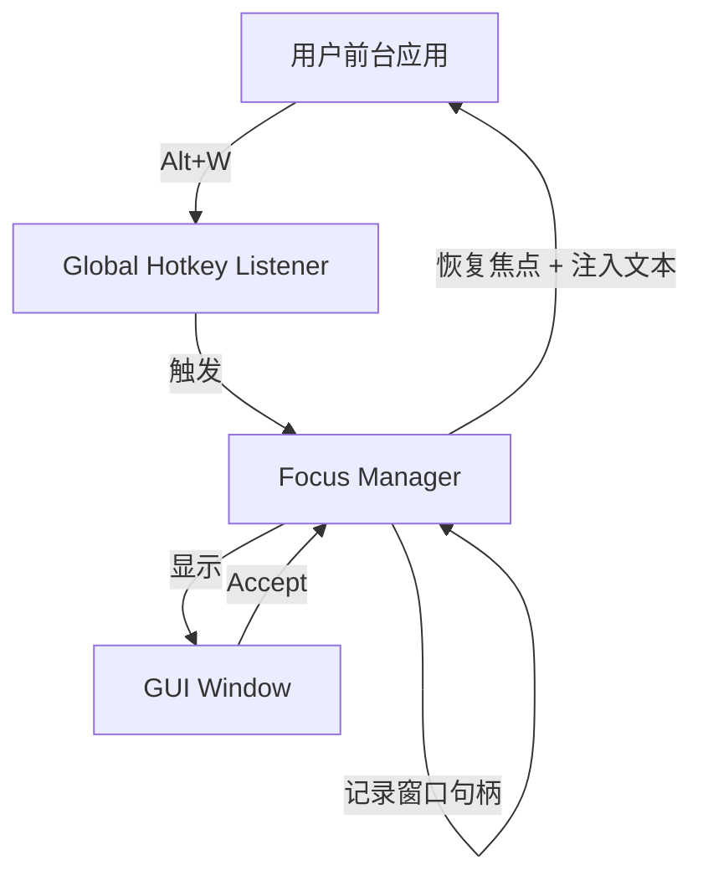
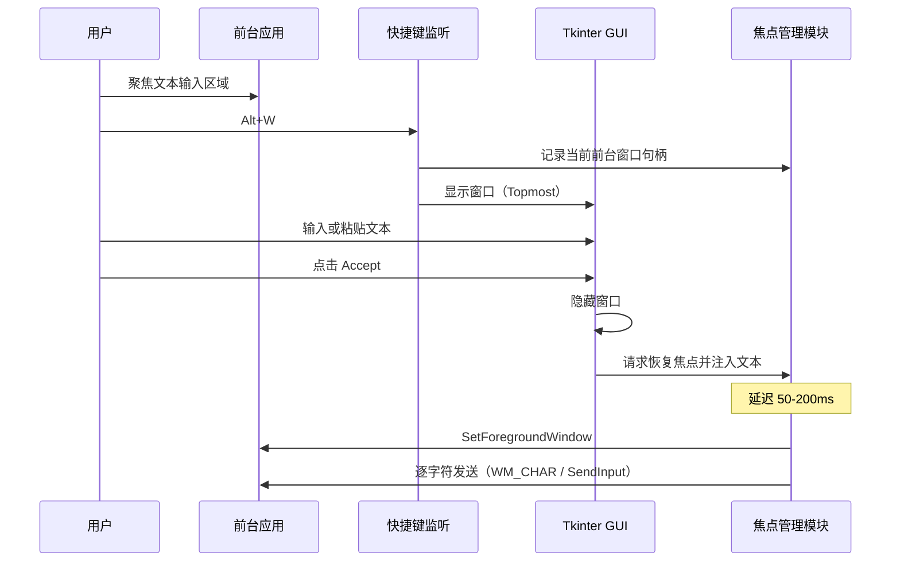

# MVP3 Spec – 基于 Python + Tkinter 的桌面级文本润色验证工具

> 本文档定义 **MVP3** 的完整规格，用于验证：
>
> **在 Windows 桌面环境下，是否可以以低工程成本，实现「显式唤起 → 文本编辑 → 回填原焦点窗口」的完整交互闭环。**
>
> 本 MVP 采用 **Python 单体桌面程序** 技术选型。

---

## 1. 目标与非目标

### 1.1 目标（Goals）

* 在 Windows 上运行一个独立桌面程序
* 通过全局快捷键显式唤起 GUI
* GUI 提供左右两个文本编辑区域（textarea）
* 用户点击按钮后，将右侧文本 **回填到唤起前获得焦点的窗口**
* 验证以下关键能力是否可行：

  * 全局快捷键
  * 焦点保存与恢复
  * 文本注入（含长文本、换行）

### 1.2 非目标（Non-Goals）

* 不验证润色算法本身（可手动输入或原样复制）
* 不追求 UI 美观或一致性
* 不考虑异常路径、失败处理
* 不考虑跨平台（仅 Windows）

---

## 2. 技术选型（固定）

| 能力        | 技术                          |
| --------- | --------------------------- |
| 语言        | Python 3.x                  |
| GUI       | Tkinter                     |
| 全局快捷键     | keyboard                    |
| 焦点 / 文本注入 | Win32 API（pywin32 或 ctypes） |

---

## 3. 核心交互模型

1. 用户在任意应用的文本输入区域中产生焦点
2. 用户通过全局快捷键唤起本工具
3. 工具窗口显示在桌面最前（Topmost）
4. 用户在工具窗口左侧输入或粘贴文本
5. 用户点击按钮，将文本复制到右侧（或直接使用右侧内容）
6. 用户点击 **Accept**
7. 工具将右侧文本回填到原焦点窗口

> MVP3 假设该流程 **一次性、单向完成**。

---

## 4. 组件划分

### 4.1 组件列表

| 组件                     | 职责             |
| ---------------------- | -------------- |
| Global Hotkey Listener | 监听 Alt+W，触发 GUI 唤起 |
| Focus Manager          | 记录唤起前的前台窗口句柄、恢复焦点、注入文本到目标窗口 |
| GUI Window (Tkinter)   | 显示文本区域与按钮      |
| Logger Module          | 记录关键操作日志（可选，不影响核心功能） |

---

## 5. 组件图



---

## 6. 操作时序（正向场景）

### 6.1 时序说明

* 仅考虑成功路径
* 不处理中途取消、窗口丢失等情况

### 6.2 时序图



---

## 7. GUI 规格（最小）

### 7.1 窗口

* 独立窗口
* 始终置顶（Topmost）
* 可用鼠标拖动

### 7.2 布局

```
+------------------------------------+
|  原始文本区      |  输出文本区      |
|  (Text widget)   |  (Text widget)   |
|                  |                  |
+------------------------------------+
|        [ Accept / 写入 ]            |
+------------------------------------+
```

* 左右均为多行 Text widget
* MVP3 不要求只读限制

---

## 8. 焦点管理规则（MVP3 假设）

* 唤起 GUI 前，记录当前前台窗口句柄（HWND）
* 点击 Accept 后按以下顺序执行：

  1. **隐藏或关闭 GUI 窗口**（确保 GUI 不再占用前台）
  2. 调用 SetForegroundWindow 恢复原窗口焦点
  3. 延迟极短时间（建议 50-200ms，处理窗口切换的异步性，避免 race condition）
  4. 执行文本注入

> **技术说明**：步骤 1-3 的顺序至关重要。如果 GUI 未隐藏就调用 SetForegroundWindow，可能导致焦点恢复失败或文本输入到错误窗口。延迟用于确保系统完成窗口激活和重绘。

> MVP3 不处理焦点恢复失败的情况。

---

## 9. 文本注入规则（MVP3 假设）

* 使用混合方案：
  * 普通字符：WM_CHAR + PostMessageW（绕过输入法拦截）
  * 换行符：SendInput 发送 Shift+Enter（软换行，避免触发聊天发送）
* 文本按字符顺序发送
* 支持：
  * 中文
  * 换行（软换行）
  * 长文本

### 9.1 技术说明

* **为何普通字符用 WM_CHAR**：SendInput 会被输入法拦截，导致中文字符无法正确输入
* **为何换行用 SendInput**：PostMessageW 无法传递修饰键状态（如 Shift），而 SendInput 可以正确发送 Shift+Enter 组合键
* **Shift+Enter 的作用**：在聊天类应用（微信、Slack、Discord）中被识别为软换行而非发送
* **VSCode Copilot 的特殊性**：VSCode Copilot 中 Enter 键本身不触发发送（需要 Ctrl+Enter 发送），因此使用 Shift+Enter 发送换行符也能正常工作，不会意外触发消息发送

### 9.2 验收场景

MVP3 应在以下典型应用场景中验证通过：

| 应用场景 | 测试环境 | 验证要点 |
|---------|---------|---------|
| 基础文本编辑 | Windows 记事本 | 文本完整写入、中文显示正确、换行处理正确 |
| Web 表单输入 | Chrome/Firefox textarea | 文本正确写入表单控件 |
| 聊天应用 | 微信、Slack、Discord | Shift+Enter 软换行生效，不触发发送 |
| 代码编辑器 | VSCode Copilot 聊天框 | 文本注入正确，支持多行代码片段，焦点恢复正常；Enter 不触发发送 |

**VSCode Copilot 场景说明**：
* 在 VSCode 中打开 Copilot 聊天面板
* 聚焦到聊天输入框
* 按 Alt+W 唤起工具
* 输入或粘贴多行代码片段（含中文注释）
* 点击 Accept，验证代码片段完整注入到 Copilot 输入框
* 验证焦点正确恢复到 VSCode Copilot 输入框
* **关键验证点**：注入的换行符不会触发消息发送（VSCode Copilot 中 Enter 键不发送，需 Ctrl+Enter）

---

## 10. 成功判定标准（Definition of Done）

MVP3 被视为成功，当且仅当：

* Alt+W 可在任意前台应用中唤起窗口
* 点击 Accept 后：

  * 原应用重新获得焦点
  * GUI 中的文本被完整写入
* 整个过程无需管理员权限

---

## 11. 日志输出（可选）

为便于调试和验证，建议实现基本日志输出：

* **记录内容**：
  * 全局快捷键触发事件
  * 原窗口句柄（HWND）
  * GUI 显示/隐藏状态
  * 焦点恢复调用结果
  * 文本注入开始/结束
  * 关键异常（如窗口句柄无效）

* **输出方式**：
  * 开发阶段：控制台输出
  * `.exe` 形态：输出到同目录下的 `Wisadel.log` 文件

* **约束**：
  * 日志功能不影响成功判定标准
  * 不记录用户文本内容
  * 单个日志文件大小不超过 1MB

---

## 12. 打包与交付（Executable）

### 12.1 交付形式

* 交付物为 **Windows 单一可执行文件（.exe）**
* 用户机器上 **不要求预装 Python**
* 可直接双击运行

### 12.2 打包工具选型

* 使用 **PyInstaller** 进行打包
* 打包模式：

  * `--onefile`（单文件）
  * `--windowed`（无控制台窗口）

> 打包行为属于实现阶段，但 MVP3 明确要求最终验证以 `.exe` 形态完成。

### 12.3 打包约束

* 所有依赖必须为本地 Python 依赖，不允许运行时下载
* 不依赖外部脚本、配置文件或网络资源
* GUI 必须作为主入口启动

### 12.4 验证要求（与打包相关）

MVP3 在以下条件下才被视为验证通过：

* `.exe` 可在未安装 Python 的 Windows 机器上运行
* 全局快捷键在 `.exe` 形态下仍然有效
* 焦点恢复与文本注入在 `.exe` 形态下行为一致

---

## 13. 结论

MVP3 的唯一目的不是产品功能，而是回答一个问题：

> **在不依赖输入法、不引入复杂桌面框架的前提下，是否可以以 exe 形式，低摩擦实现桌面级文本回填闭环。**

该规格明确要求以可执行文件作为最终验证载体，以避免开发环境假象。
